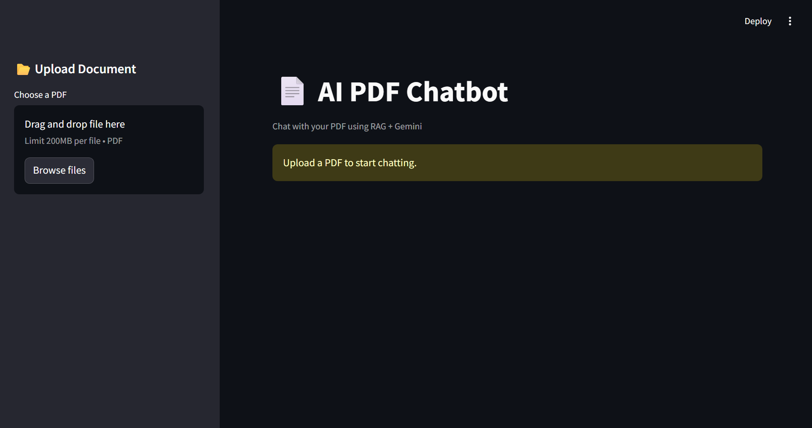
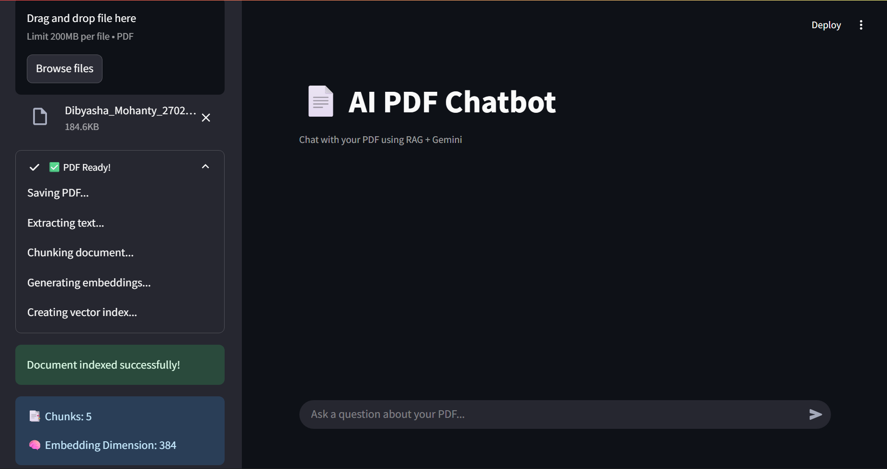
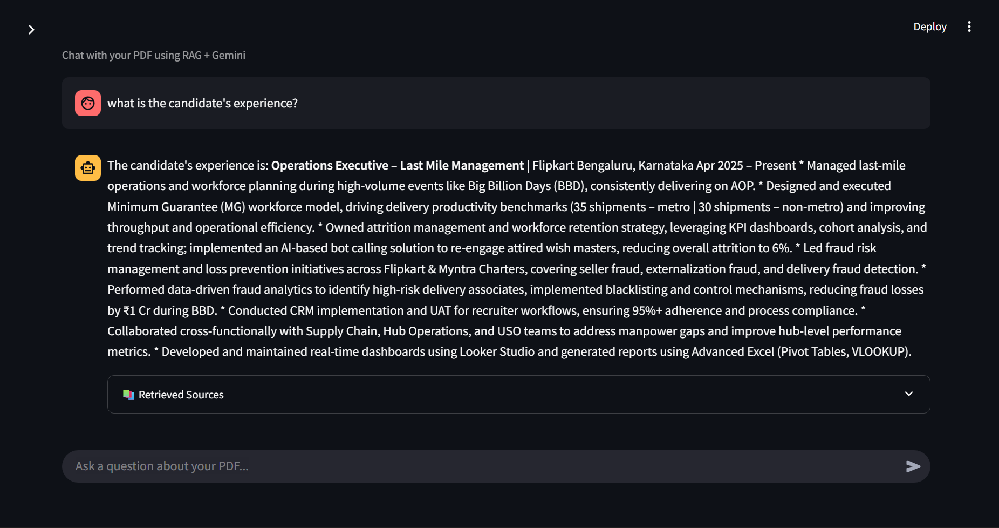
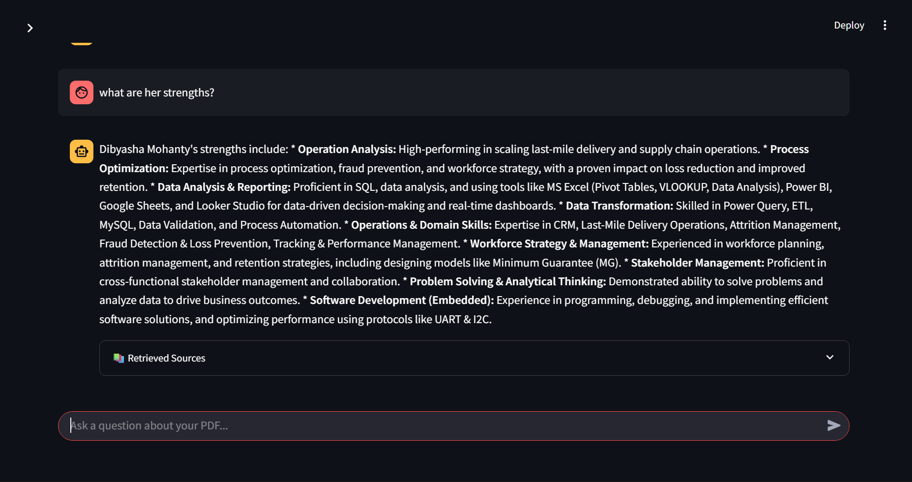

# AI PDF Chatbot

An AI-powered PDF Chatbot built using FastAPI, Streamlit, FAISS, Sentence Transformers, and Google Gemini AI.

Upload PDF documents and interact with them conversationally using Retrieval-Augmented Generation (RAG), semantic search, and AI-powered contextual responses.

---

# Features

* PDF Upload & Processing
* PDF Text Extraction
* Recursive Text Chunking
* Local Embedding Generation
* FAISS Vector Database Integration
* Semantic Search Retrieval
* Gemini-powered Response Generation
* Conversational Chat Interface
* Retrieved Source Chunk Display
* FastAPI Backend
* Streamlit Frontend
* Modular RAG Pipeline Architecture

---

# Tech Stack

## Backend

* FastAPI
* Python
* Uvicorn

## Frontend

* Streamlit

## AI / RAG Components

* Google Gemini API
* Sentence Transformers
* FAISS
* LangChain Text Splitters

## PDF Processing

* PyMuPDF

---

# Project Architecture

```text
PDF Upload
    ↓
PDF Text Extraction
    ↓
Recursive Chunking
    ↓
Embedding Generation
    ↓
FAISS Vector Storage
    ↓
User Query
    ↓
Query Embedding
    ↓
Semantic Retrieval
    ↓
Context Injection
    ↓
Gemini Response Generation
```

---

# Folder Structure

```text
AI-PDF-CHATBOT
│
├── backend
│   ├── app
│   │   ├── core
│   │   │   └── config.py
│   │   │
│   │   ├── routes
│   │   │   ├── upload.py
│   │   │   └── chat.py
│   │   │
│   │   ├── services
│   │   │   ├── chunk_service.py
│   │   │   ├── embedding_service.py
│   │   │   ├── pdf_service.py
│   │   │   ├── rag_service.py
│   │   │   ├── retrieval_service.py
│   │   │   └── vector_store_service.py
│   │   │
│   │   └── main.py
│   │
│   ├── data
│   │   ├── uploads
│   │   └── vector_store
│   │
│   ├── .env
│   └── requirements.txt
│
├── frontend
│   └── streamlit_app.py
│
├── screenshots
├── README.md
└── requirements.txt
```

---

# Installation

## 1. Clone Repository

```bash
git clone https://github.com/decoded15/ai-pdf-chatbot.git
cd ai-pdf-chatbot
```

---

## 2. Create Virtual Environment

```bash
python -m venv venv
```

### Activate Environment

#### Windows

```bash
venv\Scripts\activate
```

#### Mac/Linux

```bash
source venv/bin/activate
```

---

## 3. Install Dependencies

## Backend

```bash
cd backend

pip install -r requirements.txt
```

## Frontend

```bash
cd frontend

pip install streamlit requests
```

---

## 4. Add Gemini API Key

Create a `.env` file inside `backend/`

```env
GOOGLE_API_KEY=your_api_key_here
```

---

# Running The Project

## Start FastAPI Backend

```bash
cd backend

uvicorn app.main:app --reload
```

Backend runs on:

```text
http://127.0.0.1:8000
```

---

## Start Streamlit Frontend

```bash
cd frontend

streamlit run streamlit_app.py
```

Frontend runs on:

```text
http://localhost:8501
```

---

# RAG Workflow

```text
PDF Upload
      ↓
Text Extraction
      ↓
Chunk Generation
      ↓
Embedding Creation
      ↓
FAISS Vector Indexing
      ↓
User Question
      ↓
Query Embedding
      ↓
Semantic Retrieval
      ↓
Context Injection
      ↓
Gemini AI Response
```

---

# Screenshots

## Home



---

## PDF Upload & Processing



---

## Chat Interface




---

# Key AI Engineering Concepts Learned

* Retrieval-Augmented Generation (RAG)
* Semantic Search
* Vector Databases
* Embeddings
* Recursive Chunking
* Prompt Engineering
* Context Injection
* Similarity Search
* AI Orchestration Pipelines
* FastAPI Backend Architecture
* Streamlit Frontend Integration
* Local Embedding Models
* Semantic Retrieval Systems

---

# Future Improvements

* Multi-PDF Support
* Conversational Memory
* Citation-based Responses
* Hybrid Search
* Reranking
* OCR Support
* Authentication System
* Cloud Vector Database Integration
* Streaming Responses
* Docker Deployment

---

# Author

Built by Dibyansh (decoded15)
